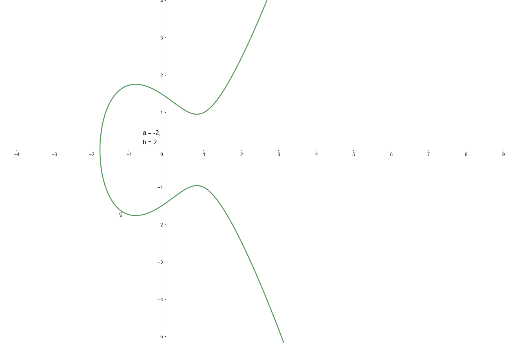

# Elliptic Curves with modulus

## Elliptic Curves in general 
The equation $g_{a, b}: \begin{cases} X \rightarrow Y \\ y^2 = x^3 + ax + b \end{cases}$ plotted over $\R$ could look like this:

 

The set $E_{a, b} := \{(x, y) | g_{a, b}(x) = y\}$ is the set of all points on the elliptic curve.

## Elliptic Curves in cryptography

In cryptography there is no direct use of an Elliptic Curve over $\R$. Instead the curve goes over a finite prime set $\Z_p : p \in ℙ$, so the equation is changed to\
 $g_{a, b}: \begin{cases} \Z_p \rightarrow \Z_p \\ y^2 \equiv x^3 + ax + b \ \ mod \ \ p\end{cases}$ with $a, b \in \Z_p$\
 \
 Let $E_{a, b} \ni P : (x_1, y_1)$ and $E_{a, b} \ni Q : (x_2, y_2)$ with $x_1, x_2, y_1, y_2, \in \Z_p$  \

 Now we define a group operation $(E_{a, b}\ , +)$ with
\
$+ : P + Q = R := (x_3, y_3) \begin{cases} x_3 \equiv s^2 - x_1 - x_2 \\ y_3 \equiv s(x_1 - x_3) - y_1\end{cases}$ \
\
with $s \equiv \begin{cases} P \neq Q :\frac{y_2 - y_1}{x_2 - x_1} \\ P = Q : \frac{3x_1^2 + a}{2y_1} \end{cases}$

$\therefore s$ is the slope between $P$ and $Q$. If $P = Q$ the slope $s = g'(x_1)$. Else, $s$ is the secant between $P$ and $Q$. $R$ is then the next point of intersection with the secant or the derivative with $g_{a, b}$:
 

$ℙ := \{n \in \N | \nexists a, b \in \N: (a, b \notin \{0, 1\}) \land (n = a \cdot b)\}$